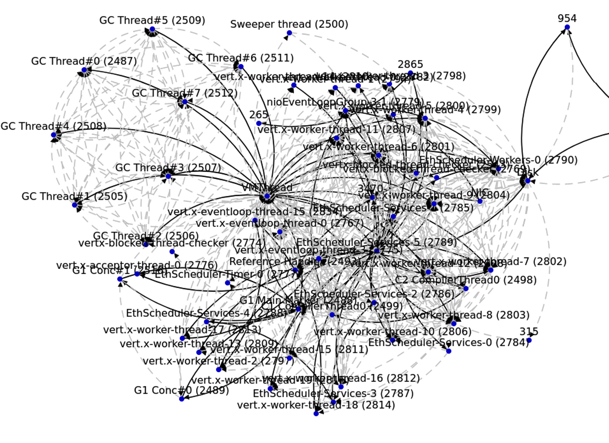

# ThreadNeck
Following the "Thread": Toward a Systematic Approach to Find Manipulatable Bottleneck In Blockchain Client

## Requirements:
Kernel: version 4.4 and newer. You also need to enable the KProbe and CONFIG_SCHEDSTATS features.

It is suggestted to use the Ubuntu 16.04.1. 


```
sudo apt-get install openjdk-11-jdk

sudo apt-get install build-essential linux-headers-$(uname -r)

sudo apt-get install ifstat

```

install latest sysstat from sources

```
git clone git://github.com/sysstat/sysstat

cd sysstat
./configure
./configure --enable-install-cron
make
sudo make install
```


## Compile flag
1. C program: compile program with "-g" option.
2. Java program: start JVM with the option "-XX:+PreserveFramePointer"
3. Rust program:  enable the "force-frame-pointers=yes" and "debug=true" flag. 


## how to run

1. profiling
```
cd ./module
make
cd ./recorder
make

./record.sh your_program_name

# During profiling, you can set the profiling frequency and profiling duration length according to the program's prompts.
```


the program_name can be found by ```ps aux```. For java program, by ```jps```

the program_name is a string like "geth" not the pid

after profiling you will see a folder containitng all kinds of profiling data under the ./recorder.


2. analyze
```
cd ./analyzer/
sh analyzer.sh  your_program_profiling_folder_path
// you need set the threshold to merge the similar thread at this stage

sh knot.sh
// this script will draw the thread wait & wake graph and output the result
```


the default value for merging the similar thread is 0.65.

if you don't merge the similar threads ,  the thread wait & wake graph will be very large and difficult to analyze:




